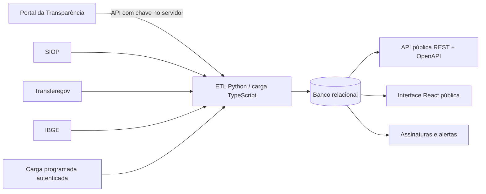

# Arquitetura

A interface é uma aplicação React/TypeScript servida por Express e consultas tipadas. O ambiente gerenciado usa um banco relacional compatível com MySQL; o arquivo `docker-compose.yml` reproduz esse ambiente localmente com MariaDB. A escolha evita divergência entre desenvolvimento local e hospedagem gerenciada.

As cargas não usam temporizadores no processo. O endpoint `/api/scheduled/sync-official-sources` aceita somente chamadas autenticadas de tarefas programadas e localiza a configuração por `schedule_cron_task_uid`. A rotina é idempotente para a primeira página de emendas: atualiza a emenda pelo par código/ano e substitui seus estágios financeiros da mesma carga.

## Fontes e escopo atual

A primeira carga real está configurada para a API de emendas do Portal da Transparência, com consulta limitada por ano e UF. O Portal disponibiliza o endpoint de emendas e de documentos relacionados [1]. A execução física, a situação de instrumentos e a prestação de contas dependem da integração planejada com o Transferegov, cuja API de transferências especiais expõe modelos de plano de ação, empenho, ordem de pagamento, relatório de gestão e metas [2]. O SIOP disponibiliza dados abertos orçamentários e informações de emendas em RDF [3].

## Referências

[1]: https://api.portaldatransparencia.gov.br/ "API do Portal da Transparência — CGU"
[2]: https://docs.api.transferegov.gestao.gov.br/transferenciasespeciais/ "API de dados abertos — Transferências Especiais do Transferegov"
[3]: https://www1.siop.planejamento.gov.br/siopdoc/doku.php/acesso_publico:dados_abertos "SIOP — Dados Abertos"
